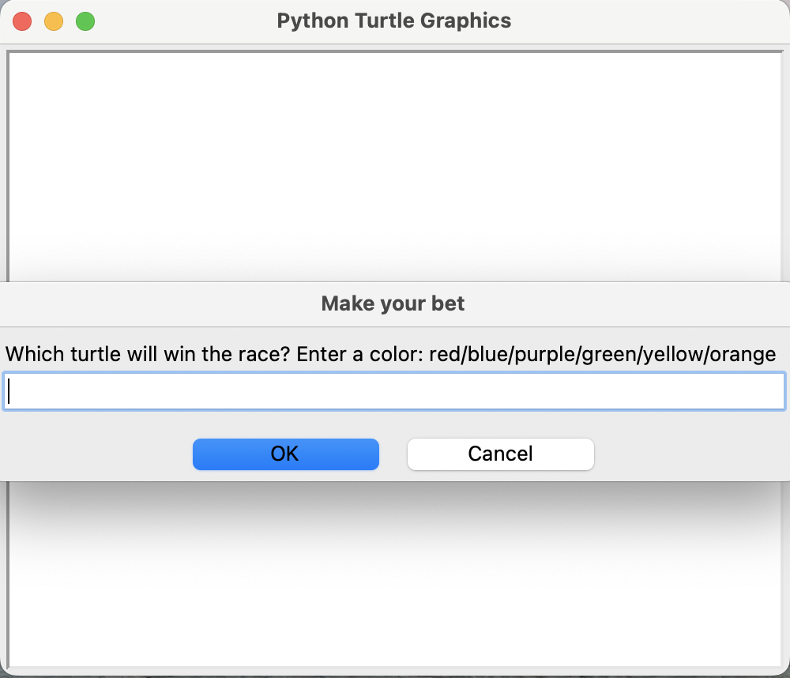
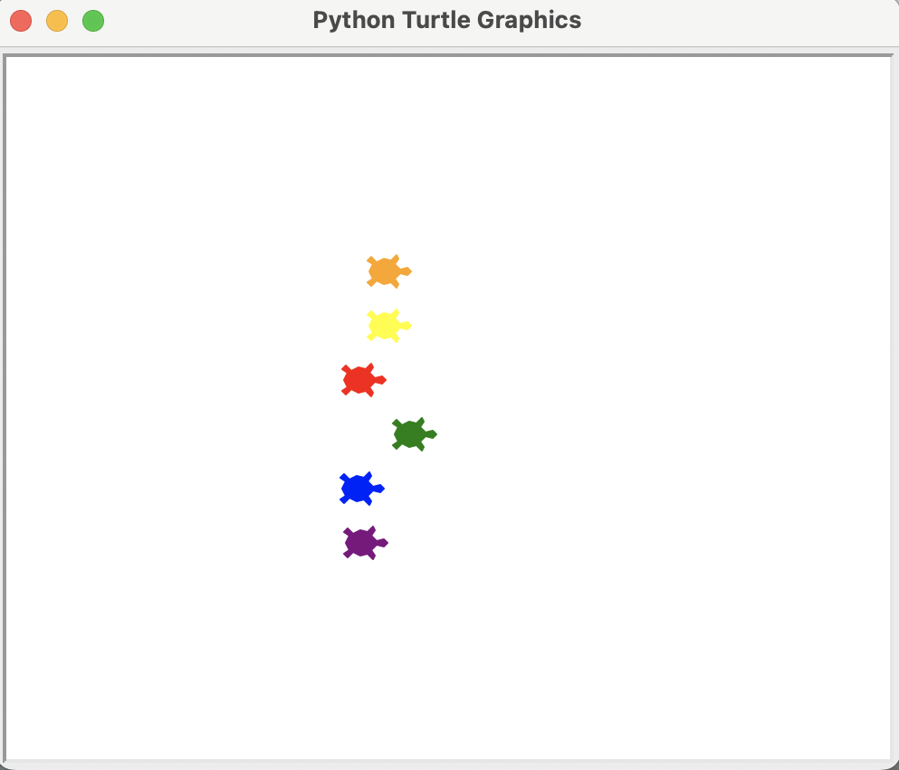
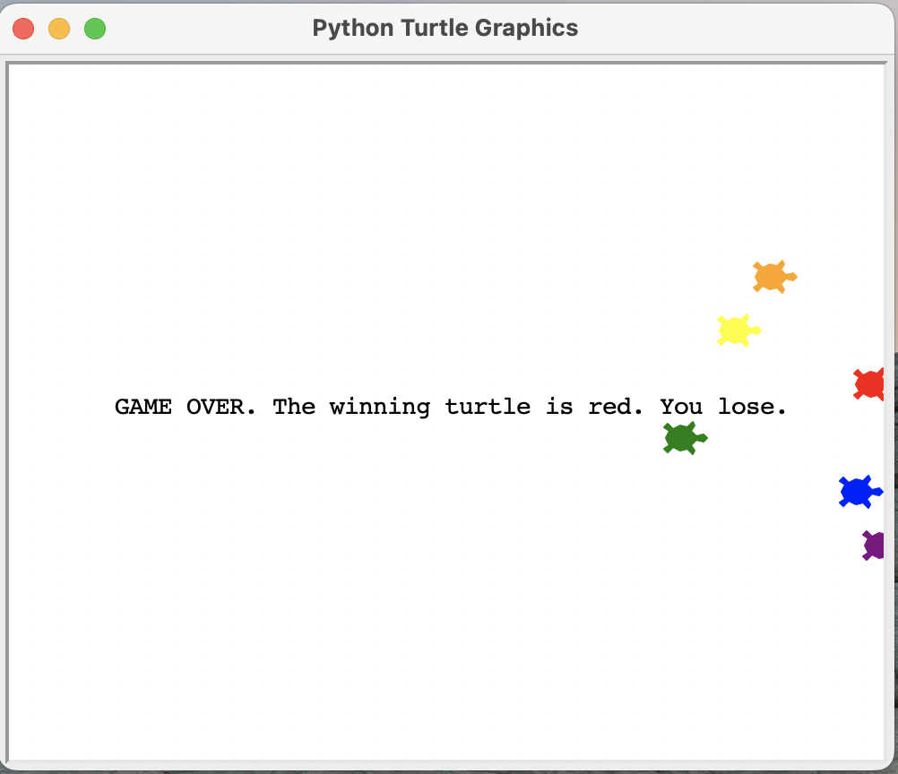

# turtle-race
A Turtle race App using Python Turtle

## Overview

Play the Turtle race game by passing a color that you think will win. Watch the turtles race and see if your turtle has won. Colors to choose:
- purple
- blue
- green
- red
- yellow
- orange

You will see a prompt to input your choice of color:


The race starts:


You will see the result of the race:



## To download

```
git clone https://github.com/menonrudhra/turtle-race.git
cd turtle-race
```

## To run the App 

```
python3 main.py
```

